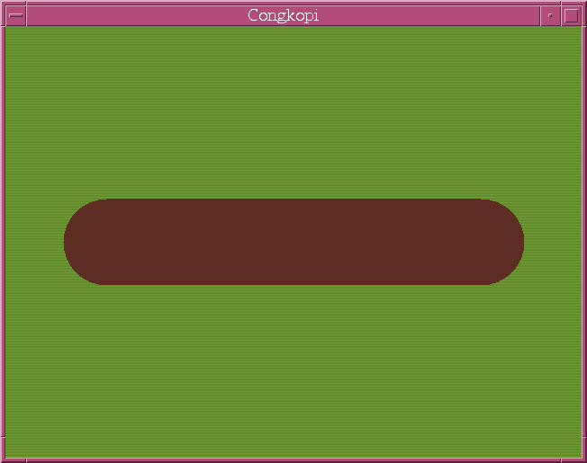

<!-- This README file is for Github. -->

# Congkopi

A Swing/AWT implementation of the board game of Congkak.
Congkak is the Malaysian variant of Southeast Asian mancala.

'Congkopi' is a portmanteau of 'Congkak' and 'Kopi' (Malay for 'coffee').
The latter word was chosen because this is written in Java..

Further details (specification, etc.) are in DEVDETAILS.md.

This game is not yet licensed, but it should end up being GPL'd.

Current state of the game:

